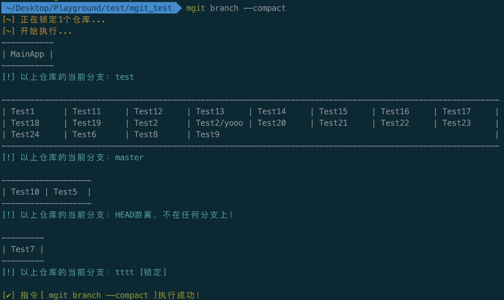
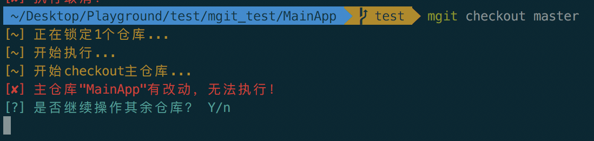
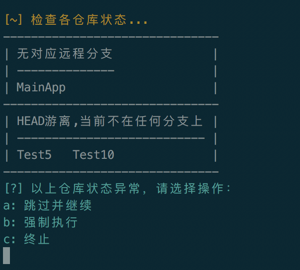
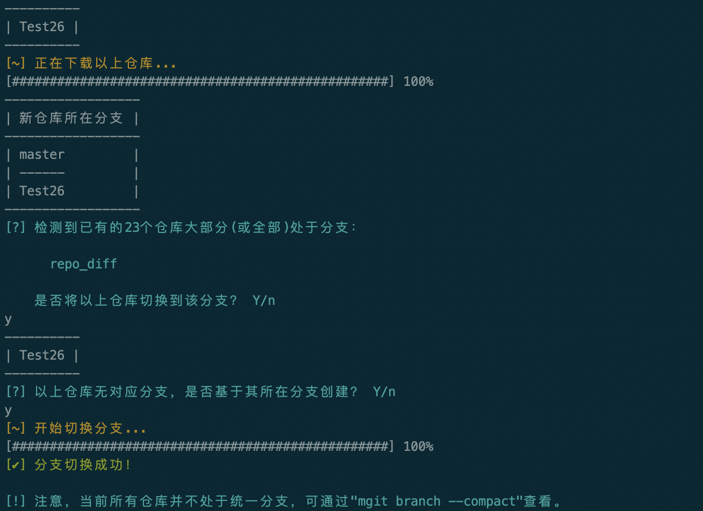

## 常用命令

> 指令描述符说明： 
>
> < > : 占位参数
>
> [  ]  : 可选组合
>
> (  )  ：必选组合 
>
>  |     :  互斥参数 
>
> ···   ：可重复指定前一个参数


### mgit    

` mgit [-l [-a]|-s] [-v] [-h]`

| 特有参数          | 说明                                                         |
| ----------------- | ------------------------------------------------------------ |
| `-a, --all`       | 指定操作所有(包含不被mgit管理)的仓库，可配合`-l`合并使用: `mgit -al` |
| `-h, --help`      | 显示帮助。                                                   |
| `-l, --list`      | 显示所有migt管理的仓库。                                     |
| `-s, --size`      | 显示所有仓库的磁盘占用量。                                   |
| `-v, --version`   | 显示mgit版本。                                               |
| `-w, --workspace` | 显示当前mgit工程管理根目录(`.mgit`所在目录)。                |

【注意】使用`-l, --list`参数列出所有被mgit管理的仓库，以表格的形式输出，其中表格头部为包含该仓库的目录（相对mgit根目录），同时标明本地缺失仓库。


### add  

` mgit add [<git-add-option>] [(--mrepo|--el-mrepo) <repo>...] [--help]`

 添加文件到暂存区

| 特有参数     | 说明                                                         |
| ------------ | ------------------------------------------------------------ |
| `--mrepo`    | 指定需要执行该指令的仓库，可指定一个或多个，空格隔开，大小写均可，如：`--mrepo boxapp BBAAccount`，若缺省则对所有仓库执行指令。 |
| `--el-mrepo` | 指定需要排除执行该指令的仓库，可指定一个或多个，空格隔开，大小写均可，如：`--el-mrepo boxapp BBAAccount`，若缺省则对所有仓库执行指令。与`--mrepo`同时指定时无效。 |
| `--help`     | 显示帮助。                                                   |

【注意】执行前会校验各个仓库所在分支是否一致，否则会提示是否继续：


### branch   

`mgit branch [<git-branch-option>|--compact] [(--mrepo|--el-mrepo) <repo>...] [--help]`

对多仓库进行分支操作

| 特有参数     | 说明                                                         |
| ------------ | ------------------------------------------------------------ |
| `--mrepo`    | 指定需要执行该指令的仓库，可指定一个或多个，空格隔开，大小写均可，如：`--mrepo boxapp BBAAccount`，若缺省则对所有仓库执行指令。 |
| `--compact`  | 以紧凑的方式显示所有仓库的当前分支。                         |
| `--el-mrepo` | 指定需要排除执行该指令的仓库，可指定一个或多个，空格隔开，大小写均可，如：`--el-mrepo boxapp BBAAccount`，若缺省则对所有仓库执行指令。与`--mrepo`同时指定时无效。 |
| `--help`     | 显示帮助。                                                   |

【注意】在指定`--compact`的情况下，其余传入的原生`git-branch-option`指令将不生效。指定`--compact`时，会将所有仓库的当前分支做一个归类，便于检查哪些仓库当前处于不同分支，对于特殊状态（HEAD游离和被锁定的仓库）也会显示出来。
 

### checkout   

`mgit checkout [<git-checkout-option>] [(--mrepo|--el-mrepo) <repo>...] [--help]`

克隆远程仓库

| 特有参数     | 说明                                                         |
| ------------ | ------------------------------------------------------------ |
| `--mrepo`    | 指定需要执行该指令的仓库，可指定一个或多个，空格隔开，大小写均可，如：`--mrepo boxapp BBAAccount`，若缺省则对所有仓库执行指令。 |
| `--el-mrepo` | 指定需要排除执行该指令的仓库，可指定一个或多个，空格隔开，大小写均可，如：`--el-mrepo boxapp BBAAccount`，若缺省则对所有仓库执行指令。与`--mrepo`同时指定时无效。 |
| `--help`     | 显示帮助。                                                   |

【注意】

1. 若指定了配置仓库，执行该指令时会先checkout配置仓库仓库，如果它本地有修改，则切换失败，需要自行将配置仓库处理干净后重试，也可以选择跳过继续。如果使用checkout切分支，
   此处建议先**取消操作并清理配置仓库**的改动再重试，因为切换的目标分支上配置仓库中的配置文件可能与当前不同，不先完成它的切换，后续操作的仓库可能产生遗漏。
   
2. 在配置仓库切换成功后，会根据配置仓库内的配置表来`checkout`其余仓库，此时如果有异常状态仓库，会给出提示：
   
3. 在配置仓库切换成功后，配置表可能发生改变，此时可能会遇到仓库缺失问题，如：A分支10个仓库，B分支11个仓库，当前从A分支切换到B分支，B分支多的1个仓库本地没有，此时会自动下载缺失仓库，并根据当前多数仓库所处分支进行推荐切换。
   
### clean

`mgit clean [(-m|-e) <repo>...] [-h]`

用于清空所有工作区和暂存区，即对所有仓库或指定仓库执行`git add . && git reset --hard`

| 特有参数         | 说明                                                         |
| ---------------- | ------------------------------------------------------------ |
| `-m, --mrepo`    | 指定需要执行该指令的仓库，可指定一个或多个，空格隔开，大小写均可，如：`--mrepo boxapp BBAAccount`，若缺省则对所有仓库执行指令。 |
| `-e, --el-mrepo` | 指定需要排除执行该指令的仓库，可指定一个或多个，空格隔开，大小写均可，如：`--el-mrepo boxapp BBAAccount`，若缺省则对所有仓库执行指令。与`--mrepo`同时指定时无效。 |
| `-h, --help`     | 显示帮助。                                                   |


### commit

`mgit commit [<git-commit-option>] [(--mrepo|--el-mrepo) <repo>...] [--help]`

| 特有参数     | 说明                                                         |
| ------------ | ------------------------------------------------------------ |
| `--mrepo`    | 指定需要执行该指令的仓库，可指定一个或多个，空格隔开，大小写均可，如：`--mrepo boxapp BBAAccount`，若缺省则对所有仓库执行指令。 |
| `--el-mrepo` | 指定需要排除执行该指令的仓库，可指定一个或多个，空格隔开，大小写均可，如：`--el-mrepo boxapp BBAAccount`，若缺省则对所有仓库执行指令。与`--mrepo`同时指定时无效。 |
| `--help`     | 显示帮助。                                                   |

【注意】

- 如果当前仓库的暂存区没有待提交内容的话，则不会执行`commit`操作。
- 执行前会校验各仓库分支是否统一。
- 本指令不支持交互式操作，因此不支持`--ammend`。


### config 

```
mgit config (-m|-u) 
mgit config -c 
mgit config (-l | -s  )
mgit config -h

```

| 特有参数                | 说明                                                         |
| ----------------------- | ------------------------------------------------------------ |
| `-c, --create-local`    | 在指定目录下创建本地配置文件，若目录不存在则自动创建。如执行：`mgit config -c /a/b/c`，则生成本地配置文件：`/a/b/c/local_manifest.json`。如果未传入值，如：`mgit config -c`，那么会在配置仓库中创建本地配置文件(若配置仓库存在的话)。 |
| `-m, --update-manifest` | 该指令用于更新mgit所使用的配置文件，如：`mgit config -m manifest.json`。 |
| `-u, --update-local`    | 该指令用于更新mgit所使用的本地配置文件，如：`mgit config -u /local_manifest.json`。 |
| `-l, --list`            | 列出当前MGit所有配置，无参数，如：`mgit config -l`。         |
| `-s, --set`             | 对MGit进行配置，遵守格式：`mgit config -s  `，如：`mgit config -s maxconcurrentcount 5`。 |
| `-h, --help`            | 显示帮助。                                                   |


命令使用细节请查看[config配置文档](../config/config-env.md)


### delete 

`mgit delete <repo>... [-h]`

该指令用于删除单一仓库的，包括被mgit管理存在于.mgit文件夹中的git实体和存在.mgit外部的工程文件。

| 特有参数     | 说明       |
| ------------ | ---------- |
| `-h, --help` | 显示帮助。 |

【注意】如果需要删除某个仓库，仅仅手动删除.mgit外部的工程文件并不完整，还需要删除.mgit/source-git内的git实体，因此如果需要删除一个仓库的话，最好使用该指令来完整删除。


### fetch  

`mgit fetch [<git-fetch-option>] [(--mrepo|--el-mrepo) <repo>...] [--help]`

 从远程仓库获取代码

| 特有参数     | 说明                                                         |
| ------------ | ------------------------------------------------------------ |
| `--mrepo`    | 指定需要执行该指令的仓库，可指定一个或多个，空格隔开，大小写均可，如：`--mrepo boxapp BBAAccount`，若缺省则对所有仓库执行指令。 |
| `--el-mrepo` | 指定需要排除执行该指令的仓库，可指定一个或多个，空格隔开，大小写均可，如：`--el-mrepo boxapp BBAAccount`，若缺省则对所有仓库执行指令。与`--mrepo`同时指定时无效。 |
| `--help`     | 显示帮助。                                                   |


### forall  

`mgit forall -c '<instruction>' [(-m|-e) <repo>...] [-n] [-h]`

该指令用于在指定（或所有）仓库上执行自定义指令

| 特有参数           | 说明                                                         |
| ------------------ | ------------------------------------------------------------ |
| `-c, --command`    | 指定需要执行的shell命令，如：`mgit -c "git status -s"`（注意要带引号）。 |
| `-n, --concurrent` | 可选参数，若指定，则shell命令以多线程方式执行（若缺省则以单线程串行方式执行）。 |
| `-m, --mrepo`      | 指定需要执行该指令的仓库，可指定一个或多个，空格隔开，大小写均可，如：`--mrepo boxapp BBAAccount`，若缺省则对所有仓库执行指令。 |
| `-e, --el-mrepo`   | 指定需要排除执行该指令的仓库，可指定一个或多个，空格隔开，大小写均可，如：`--el-mrepo boxapp BBAAccount`，若缺省则对所有仓库执行指令。与`--mrepo`同时指定时无效。 |
| `-h, --help`       | 显示帮助。                                                   |


### info   

`mgit info <repo>... [-h]`

产看一个仓库的信息

| 特有参数     | 说明       |
| ------------ | ---------- |
| `-h, --help` | 显示帮助。 |


### log  

`mgit log <repo> [-n] [-h]`

 输出单一仓库的log

| 特有参数       | 说明                                         |
| -------------- | -------------------------------------------- |
| `-h, --help`   | 显示帮助。                                   |
| `-n, --number` | 指定需要显示的提交log个数，不指定则默认500。 |


### merge

```
mgit merge [] [--pull] [(--mrepo|--el-mrepo) ...] [--help]
mgit merge --continue
mgit merge --abort
```

| 特有参数     | 说明                                                         |
| ------------ | ------------------------------------------------------------ |
| `--mrepo`    | 指定需要执行该指令的仓库，可指定一个或多个，空格隔开，大小写均可，如：`--mrepo boxapp BBAAccount`，若缺省则对所有仓库执行指令。 |
| `--el-mrepo` | 指定需要排除执行该指令的仓库，可指定一个或多个，空格隔开，大小写均可，如：`--el-mrepo boxapp BBAAccount`，若缺省则对所有仓库执行指令。与`--mrepo`同时指定时无效。 |
| `--pull`     | 可选参数，指定后在合并仓库前会自动拉取远程分支更新代码，否则会有交互式询问。如：`mgit merge --pull` |
| `--continue` | MGit自定义参数，仅在操作多仓库过程中出现问题停止，执行状态进入中间态后可用。该参数只能单独使用，解决问题后可执行`mgit merge --continue`继续操作其余仓库。 |
| `--abort`    | Git原生参数，用于取消`git merge`中间态，但MGit做了增强，该参数可同时消除`mgit merge`中间态，且只能单独使用：`mgit merge --abort` |
| `--help`     | 显示帮助。                                                   |

【注意】

1. 若指定了配置仓库，执行该指令时会先merge配置仓库，然后根据它内部的配置表merge其余仓库。配置仓库merge完成后，配置表可能发生改变，此时可能会检测到部分仓库本地缺失，此时会自动下载并引导分支切换（提示如checkout指令所述）。
2. 执行前会校验各仓库分支是否统一。
3. 中间态：由于该操作分为两段式，第一阶段操作配置仓库，第二阶段操作子仓库，且在操作前均可能拉取最新代码，如果操作失败会进入`中间态`。根据提示解决问题后执行`mgit merge --continue`即可继续执行，也可执行`mgit merge --abort`放弃操作。
4. 该指令默认添加`--no-ff`参数，如果需要fast-forwarding，请手动添加`--ff`。


### pull

```
mgit pull [ [(--mrepo|--el-mrepo) ...] [--auto-exec] [--no-check] [--include-lock] [--help]
mgit pull --continue`
mgit pull --abort
```

| 特有参数         | 说明                                                         |
| ---------------- | ------------------------------------------------------------ |
| `--auto-exec`    | 指定该参数会跳过所有交互场景，并自动选择需要的操作执行。该参数主要用于脚本调用mgit进行自动化操作，日常RD开发不应当使用。 |
| `--mrepo`        | 指定需要执行该指令的仓库，可指定一个或多个，空格隔开，大小写均可，如：`--mrepo boxapp BBAAccount`，若缺省则对所有仓库执行指令。 |
| `--el-mrepo`     | 指定需要排除执行该指令的仓库，可指定一个或多个，空格隔开，大小写均可，如：`--el-mrepo boxapp BBAAccount`，若缺省则对所有仓库执行指令。与`--mrepo`同时指定时无效。 |
| `--no-check`     | 指定该参数意味着执行前跳过仓库的状态检查，直接对指定或所有仓库执行pull操作，有一定风险，请慎重执行。 |
| `--include-lock` | 指定该参数意味着同时也操作lock仓库。                         |
| `--continue`     | MGit自定义参数，仅在操作多仓库过程中出现问题停止，执行状态进入中间态后可用。该参数只能单独使用，解决问题后可执行`mgit pull --continue`继续操作其余仓库。 |
| `--abort`        | MGit自定义参数，仅在操作多仓库过程中出现问题停止，执行状态进入中间态后可用。该参数用于清除操作中间态，且只能单独使用：`mgit pull --abort`。 |
| `--help`         | 显示帮助。                                                   |

【注意】

1. 若指定了配置仓库，执行该指令时会先pull配置仓库，然后根据它内部的配置表pull其余仓库。
2. 执行时，会查看当前分支（如A）和远程分支（若有的话，如origin/A），只有当前分支（A）与远程分支（origin/A）出现落后或分叉的仓库才会执行指令。
3. 执行时，如果本地分支A和其跟踪的远程分支origin/A存在分叉，意味着执行pull之后会跟远程分支合并产生新节点，此时mgit会自动输入合法的log信息，并生成新提交。
4. 为了保证本地保存的远程分支（origin/A）为最新，执行前会先fetch一次。
5. 对于本地有异常的仓库，会提示执行操作，需要二次确认。
6. 执行前会校验各仓库分支是否统一。
7. 中间态：操作主仓库后如果导致配置文件冲突，会进入中间态。解决完冲突后，执行`mgit pull --continue`继续操作子仓库，或执行`mgit pull --abort`放弃本次操作。

### push

`mgit push [<git-push-option>|--auto] [(--mrepo|--el-mrepo) <repo>...] [--group-id] [--help]`

| 特有参数     | 说明                                                         |
| ------------ | ------------------------------------------------------------ |
| `--mrepo`    | 指定需要执行该指令的仓库，可指定一个或多个，空格隔开，大小写均可，如：`--mrepo boxapp BBAAccount`，若缺省则对所有仓库执行指令。 |
| `--el-mrepo` | 指定需要排除执行该指令的仓库，可指定一个或多个，空格隔开，大小写均可，如：`--el-mrepo boxapp BBAAccount`，若缺省则对所有仓库执行指令。与`--mrepo`同时指定时无效。 |
| `--group-id` | 指定一个group id，可将本次提交在远程做归类，若未指定则自动生成。生成的id将自动附加在url后：`mgit push --group-id  = git push origin HEAD:refs/for/%topic=` |
| `--help`     | 显示帮助。                                                   |

【注意】

1. 执行时会查看当前分支（如A）和远程分支（若有的话，如origin/A），只有当前分支（A）超前远程分支（origin/A）的仓库才会执行指令。注意，为了保证本地保存到远程分支（origin/A）为最新，执行前会先fetch一次。
2. 对于本地有异常的仓库，会提示执行操作（如`pull`指令描述所示）。
3. 执行前会校验各仓库分支是否统一。


### rebase

```
mgit rebase [<git-rebase-option>] [(--mrepo|--el-mrepo) <repo>...] [--help]
mgit rebase --continue
mgit rebase --abort
```

| 特有参数     | 说明                                                         |
| ------------ | ------------------------------------------------------------ |
| `--mrepo`    | 指定需要执行该指令的仓库，可指定一个或多个，空格隔开，大小写均可，如：`--mrepo boxapp BBAAccount`，若缺省则对所有仓库执行指令。 |
| `--el-mrepo` | 指定需要排除执行该指令的仓库，可指定一个或多个，空格隔开，大小写均可，如：`--el-mrepo boxapp BBAAccount`，若缺省则对所有仓库执行指令。与`--mrepo`同时指定时无效。 |
| `--continue` | MGit自定义参数，仅在操作多仓库过程中出现问题停止，执行状态进入中间态后可用。该参数只能单独使用，解决问题后可执行`mgit rebase --continue`继续操作其余仓库。 |
| `--abort`    | Git原生参数，用于取消`git rebase`中间态，但MGit做了增强，该参数可同时消除`mgit rebase`中间态，且只能单独使用：`mgit rebase --abort` |
| `--help`     | 显示帮助。                                                   |

【注意】

1. 执行前会校验各仓库分支是否统一。
2. 该操作禁止使用`-i`和`--interactive`参数。
3. 中间态：同merge操作。


### reset 

`mgit reset [<git-reset-option>] [(--mrepo|--el-mrepo) <repo>...] [--help]`

| 特有参数     | 说明                                                         |
| ------------ | ------------------------------------------------------------ |
| `--mrepo`    | 指定需要执行该指令的仓库，可指定一个或多个，空格隔开，大小写均可，如：`--mrepo boxapp BBAAccount`，若缺省则对所有仓库执行指令。 |
| `--el-mrepo` | 指定需要排除执行该指令的仓库，可指定一个或多个，空格隔开，大小写均可，如：`--el-mrepo boxapp BBAAccount`，若缺省则对所有仓库执行指令。与`--mrepo`同时指定时无效。 |
| `--help`     | 显示帮助。                                                   |

【注意】执行前会校验各仓库分支是否统一。


### snap

`mgit snap [-m <message>|-r <snapshot_id>|-l] [-h]`

该指令用于根据当前多仓库状态生成快照，也可以从快照中恢复。

| 特有参数        | 说明                                                         |
| --------------- | ------------------------------------------------------------ |
| `-r, --restore` | 从快照中恢复当前仓库，该操作执行前会清空所有未提交的仓库改动，请谨慎执行。用法：`mgit snap -r `。 |
| `-l, --list`    | 列出所有本地存储的快照。                                     |
| `-m, --message` | 执行本次快照时附带的说明信息。用法：`mgit snap -m 'version x'`。 |
| `-h, --help`    | 显示帮助。                                                   |


### stash

`mgit stash [<option> <value>...] [(--mrepo|--el-mrepo) <repo>...] [--help]`

| 特有参数     | 说明                                                         |
| ------------ | ------------------------------------------------------------ |
| `--apply`    | 恢复储藏，用法：`mgit stash --apply 'stash_name'`。          |
| `--mrepo`    | 指定需要执行该指令的仓库，可指定一个或多个，空格隔开，大小写均可，如：`--mrepo boxapp BBAAccount`，若缺省则对所有仓库执行指令。 |
| `--clear`    | 清空所有储藏。                                               |
| `--el-mrepo` | 指定需要排除执行该指令的仓库，可指定一个或多个，空格隔开，大小写均可，如：`--el-mrepo boxapp BBAAccount`，若缺省则对所有仓库执行指令。与`--mrepo`同时指定时无效。 |
| `--push`     | 添加储藏，用法：`mgit stash --push 'stash_name'`。           |
| `--pop`      | 恢复储藏，用法：`mgit stash --pop 'stash_name'`。            |
| `--list`     | 显示储藏列表。                                               |
| `--help`     | 显示帮助。                                                   |


### status

`mgit status [(-m|-e) <repo>...] [-h]`

| 特有参数         | 说明                                                         |
| ---------------- | ------------------------------------------------------------ |
| `-m, --mrepo`    | 指定需要执行该指令的仓库，可指定一个或多个，空格隔开，大小写均可，如：`--mrepo boxapp BBAAccount`，若缺省则对所有仓库执行指令。 |
| `-e, --el-mrepo` | 指定需要排除执行该指令的仓库，可指定一个或多个，空格隔开，大小写均可，如：`--el-mrepo boxapp BBAAccount`，若缺省则对所有仓库执行指令。与`--mrepo`同时指定时无效。 |
| `-h, --help`     | 显示帮助。                                                   |

status指令是一个比较重要的指令，MGit2.0版对其进行了加强，它的显示区域分为两部分：

- 文件状态：显示四个分类的文件状态列表（`暂存区`，`工作区`，`特殊`，`冲突`）
- 分支状态：显示当前分支和远程分支的对比状态（`超前`，`落后`，`同步`，`游离`）

【注意】

1. 文件状态显示区对所有文件进行归类，每个文件左侧会显示当前文件改动状态：`已修改`，`已添加`, `已删除`，`重命名`，`已拷贝`，`未跟踪`，`被忽略`，其中冲突区的文件会显示两个状态，如：`[添加|修改]`，左侧表示当前分支状态，右侧表示合并分支状态，即当前分支上的该文件为添加状态，合并过来的分支上的该文件为修改状态。
2. 对于干净的仓库，无输出。


###  sync 

`mgit sync [-a|-n|-c] [<repo>...] [-p] [-o] [-h]`

该指令用于根据配置文件同步被锁定的仓库，更新仓库和下载缺失仓库。

| 特有参数         | 说明                                                         |
| ---------------- | ------------------------------------------------------------ |
| `-a, --all`      | 对所有(包含**不被mgit管理**的)仓库操作:1.如果本地缺失则下载。2.如果本地存在且被锁定则同步到锁定状态。注意，如果需要下载仓库，需要配置仓库URL，否则跳过。 |
| `-c, --clone`    | 下载一组仓库(包含**不被mgit管理**的仓库)，如: `mgit sync -c repo1 repo2...`。 |
| `-n, --new-repo` | 下载配置表中指定**被mgit管理**，但本地不存在的仓库，已有仓库不做任何处理。 |
| `-o, --no-link`  | 指定后，对于新下载的仓库不会将`.git`实体迁移到.mgit/source-git文件夹中管理。该参数适合开发中途接入mgit的用户使用。 |
| `-p, --pull`     | 若被操作仓库本地存在的话，则进一步执行pull操作更新，配合其他指令使用，如: mgit sync -ap。 |
| `-h, --help`     | 显示帮助。                                                   |

特殊用法：

- `mgit sync`：作用同`-a`，区别是只操作**被mgit管理的仓库**。
- `mgit sync ...`：作用同`-a`，区别是只操作指定(包含**不被mgit管理**的)仓库。

操作仓库作用域总结：

| 指令            | 被mgit管理的仓库 | 不被mgit管理仓库 |
| --------------- | ---------------- | ---------------- |
| `mgit sync`     | ✔                | ✘                |
| `mgit sync ...` | ✔                | ✔                |
| `mgit sync -a`  | ✔                | ✔                |
| `mgit sync -c`  | ✔                | ✔                |
| `mgit sync -n`  | ✔                | ✘                |

【注意】

1. **同步**：是指仓库存在且被锁定（指定了`lock`字段）的情况下，将仓库切换到配置文件指定的锁定状态（`branch`，`tag`或`commit-id`)，此时：
2. 需要切换分支的话，若有本地改动，则切换失败；若无本地分支，则提示是否创建并切换；若有对应分支，则直接切换
3. 需要切到具体`tag`或`commit-id`的话，若仓库不存在对应值则失败。
4. 在处理缺失仓库时，如果.mgit/source-git文件夹下有缺失的git实体，那么将直接从该实体clone出来（并将remote url修改为远程地址），否则直接从远程clone。


### tag 

`mgit tag [<git-tag-option>] [(--mrepo|--el-mrepo) <repo>...] [--help]`

| 特有参数     | 说明                                                         |
| ------------ | ------------------------------------------------------------ |
| `--mrepo`    | 指定需要执行该指令的仓库，可指定一个或多个，空格隔开，大小写均可，如：`--mrepo boxapp BBAAccount`，若缺省则对所有仓库执行指令。 |
| `--el-mrepo` | 指定需要排除执行该指令的仓库，可指定一个或多个，空格隔开，大小写均可，如：`--el-mrepo boxapp BBAAccount`，若缺省则对所有仓库执行指令。与`--mrepo`同时指定时无效。 |
| `--help`     | 显示帮助。                                                   |


## 一些使用技巧

| 特有参数                                     | 说明                      |
| -------------------------------------------- | ------------------------- |
| mgit -l                                      | 查看当前被管理的仓库      |
| mgit info <repo1> <repo2>... #repo大小写均可 | 查看某个仓库的详细信息    |
| mgit branch --compact                        | 查看归并分支              |
| mgit clean                                   | 一键清空工作区            |
| mgit status                                  | 产看仓库分支超前/落后情况 |
| mgit push                                    | 一键推动新分支、新提交    |

